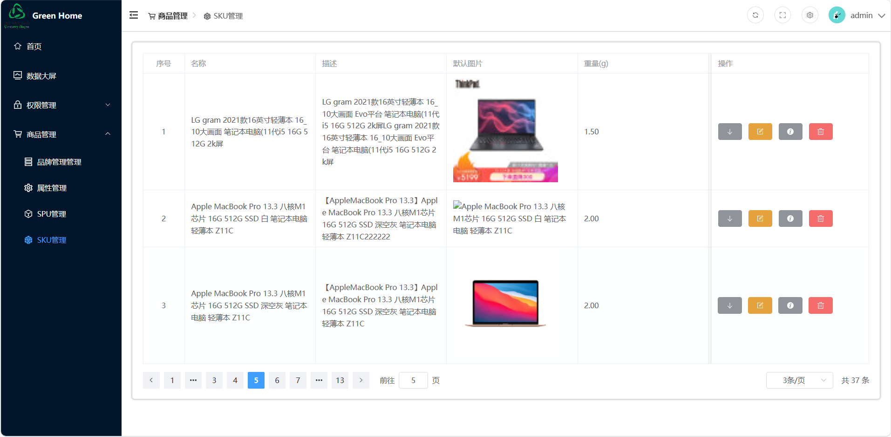

# vue-admin
基于vue3＋Ts的后台管理系统
- 使用pinia进行状态管理
- 封装了Axios
- 使用echarts开发数据大屏
- 使用scss预编译器  
- 路由鉴权
- 权限管理
# 包含众多模块
- 权限管理
  - 用户管理
  - 角色管理
  - 菜单管理
- 商品管理
  - 品牌管理
  - 属性管理
  - Spu管理
  - Sku管理
- 数据大屏展示
## 1. 初始化
```shell
npm install
```
## 2. 运行项目
```shell
npm run dev
```
## 3. 项目展示
1. 首页

2. 数据大屏

3. 用户管理

4. 角色管理

5. 菜单管理

6. 品牌管理

7. 属性管理

8. spu管理

9. sku管理

